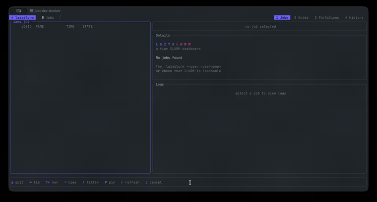

<p align="center">
  
</p>

<p align="center">
  A terminal UI for <a href="https://slurm.schedmd.com/overview.html">Slurm</a>. Like <a href="https://github.com/jesseduffield/lazygit">lazygit</a>, but for HPC clusters.
</p>

<p align="center">
  <a href="https://github.com/hill/lazyslurm/actions"></a>
  <a href="https://crates.io/crates/lazyslurm"></a>
  <a href="https://opensource.org/licenses/MIT"></a>
</p>

<p align="center">
  <a href="media/demo.mp4"></a>
</p>

## Why This Exists

Slurm's CLI is powerful but clunky for monitoring.
This gives you the lazygit experience for your cluster.
Built in Rust with [ratatui](https://ratatui.rs/) and released as a single binary.

## Features

- Monitor your jobs with live log tailing, job details and ability to cancel jobs
- See per-node state, CPU load, free memory and GPU (gres) allocation across the cluster
- Partition availability, idle/allocated nodes and time limits.
- See finished jobs from `sacct` with details

## Installation

### Binary Releases

Download the latest binary for your platform from [GitHub Releases](https://github.com/hill/lazyslurm/releases):

```bash
# Linux x64
curl -L https://github.com/hill/lazyslurm/releases/latest/download/lazyslurm-linux-x64.tar.gz | tar xz
sudo mv lazyslurm /usr/local/bin/

# macOS (Apple Silicon)
curl -L https://github.com/hill/lazyslurm/releases/latest/download/lazyslurm-macos-arm64.tar.gz | tar xz
sudo mv lazyslurm /usr/local/bin/

# macOS (Intel)
curl -L https://github.com/hill/lazyslurm/releases/latest/download/lazyslurm-macos-x64.tar.gz | tar xz
sudo mv lazyslurm /usr/local/bin/
```

### Homebrew

```bash
brew install hill/tap/lazyslurm
```

### Cargo

If you have [Rust installed](https://rustup.rs/):

```bash
cargo install lazyslurm
```

### Gah

```sh
gah install hill/lazyslurm
```

## Usage

```bash
# Monitor all jobs for the current user
lazyslurm

# Filter to a specific user
lazyslurm --user username

# Filter to a specific partition
lazyslurm --partition gpu
```

The `Jobs` tab works without any extra setup. The `Nodes` and `Partitions` tabs use `sinfo`, and `History` uses `sacct` (which needs Slurm accounting enabled on the cluster).

### Keyboard Controls

**Global**

| Key | Action |
|-----|--------|
| `q` / `Ctrl+C` | Quit |
| `Tab` / `Shift+Tab` | Switch tabs |
| `1`–`4` | Jump to a tab |
| `↑/↓` or `j/k` | Navigate the current list |
| `r` | Refresh |
| `u` | Filter by user |

**Jobs tab**

| Key | Action |
|-----|--------|
| `←/→` or `h/l` | Move focus between panels |
| `Enter` | Fullscreen the focused pane |
| `/` | Filter the list by name or id |
| `P` | Pin / unpin the selected job |
| `c` | Cancel the selected job |
| `y` | Raw log view (with the Logs pane focused) |

**History tab**

| Key | Action |
|-----|--------|
| `Enter` | Open the job detail view |
| `y` | Raw log view (in the detail view) |

**Log views**

| Key | Action |
|-----|--------|
| `G` / `g` | Follow the tail |
| `y` | Open the raw view, then drag-select to copy |
| `Esc` | Back |

## Development

Requires Docker and [just](https://github.com/casey/just). The dev container runs a full Slurm install with accounting (slurmdbd + MariaDB), so every tab works locally.

```bash
# Build and start the Slurm container
just slurm_up

# Get a shell inside it
just slurm_shell

# Inside the container (your code is mounted at /workspace)
cargo run

# Submit some test jobs
just slurm_populate

# Inspect the cluster
just slurm_status    # squeue + sinfo
just slurm_prio      # sprio priority breakdown
just slurm_share     # sshare fairshare usage
just slurm_clear_jobs
```

Your source is mounted into the container, so changes are picked up immediately.

## License

MIT
